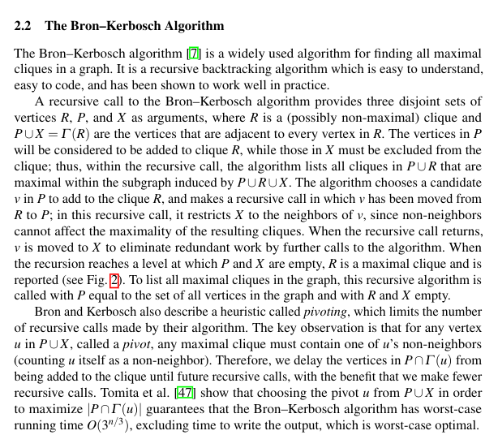
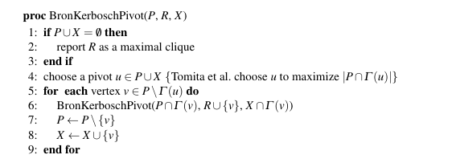
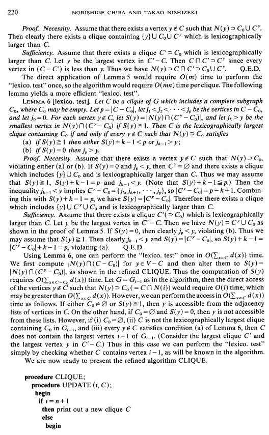
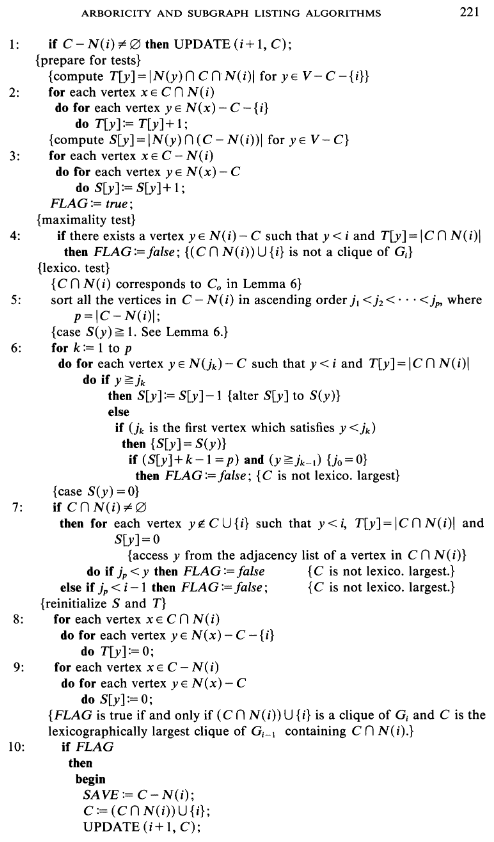
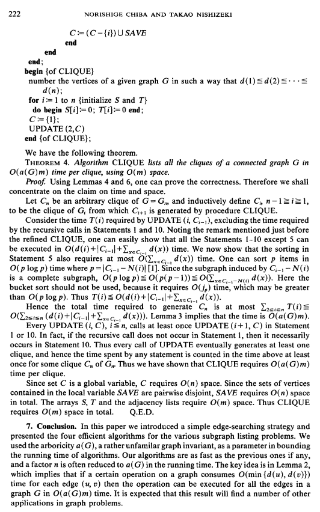

# Daa-Assign

A showcase of graph visualization code and assignment in CS F364 - DAA subject.

## Problem Statement 

Implement **Maximal Clique Enumeration Algorithm** in shortest time possible, i.e. use optimal algorithm

**In an undirected graph G, a clique is a complete subgraph of G, i.e., a subgraph in which any two vertices are adjacent(i.e all vertices are connect to each other fully).If a clique is not a proper subgraph of another clique then it is called a maximal clique. The set of vertices of a maximal clique of the complementary graph of G is a maximal independent set of G.**

[Assign Description Link](https://docs.google.com/document/d/1bVLHY6aKS5bJuHJ_ML2qOB4gMdD0zkCAA_0nNVBXmaw/edit?tab=t.0)

### Paper 1: The worst-case time complexity for generating all maximal cliques and computational experiments - Mohammad
They showed experimentally that the computing time per clique is almost independent of the graph size for random graphs and that the total computing time is proportional to (3.14)^n/3 for Moon–Moser graphs [17] of n vertices.
We present here a depth-first search algorithm for generating all the maximal cliques of an undirected graph, in
which pruning methods are employed as in the Bron–Kerbosch algorithm [6]. All the maximal cliques generated are
output in a tree-like form. Subsequently, we prove that its worst-case running time complexity is O(3n/3 ) for a graph
with n vertices. This is the best one could hope for as a function of n, since there exist up to 3n/3 maximal cliques in a
graph with n vertices as shown by Moon and Moser [17]. Our algorithm differs from that of Bron and Kerbosch in the
format of the printed maximal cliques. The difference is important theoretically, since it is essential to the establishment
of the optimal worst-case time complexity.


### Paper 2: Listing All Maximal Cliques in Sparse Graphs in Near-Optimal Time - Hemanth




### Paper 3: Arboricity and Subgraph Listing Algorithms - Harsh, Anshul





## Website

To make the c++ code run on the web, We used WebAssembly to compile a c++ code into .wasm format, bundle it with the script.js file along with html and css files and then deploy it through github pages. for compiling c++ to webAssembly code, We used **emscripten**. to instal locally, we did this :
```
git clone https://github.com/emscripten-core/emsdk.git
cd emsdk
./emsdk install latest
./emsdk activate latest
source ./emsdk_env.sh
```
Also, tag every function in c++ which we plan to invoke through the website(and subsequently through javascript) with **extern "C"**. 
For compilation into webassembly with emscripten locally, I used : 
```
emcc main.cpp -o main.js -s WASM=1 -s NO_EXIT_RUNTIME=1 -s "EXPORTED_RUNTIME_METHODS=['ccall']" -s EXPORTED_FUNCTIONS="['_submit']"
```

```
Include the following in your report:
1. Largest size of the clique in each dataset.
2. Total number of maximal cliques in each dataset.
3. Execution time of your implementation on each dataset (histogram).
4. Distribution of different size cliques (histogram).

Include the following in your submission.

1. C/C++ implementation of all three algorithms.
2. A Readme consisting of execution instruction, dataset preparation, and individual contributions to the project.
3. A detailed report describing the algorithms and experimental observation mentioned above.
4. Include your project webpage's link (Github or other) in the Readme. On the project page, include the experimental observations and any other observations you have.
5. (Optional) Mention if you find an interesting application where you can solve the problem using clique enumeration and counting. That way, we can think about possible publication! Email me if you (and your group) have any such ideas.
```